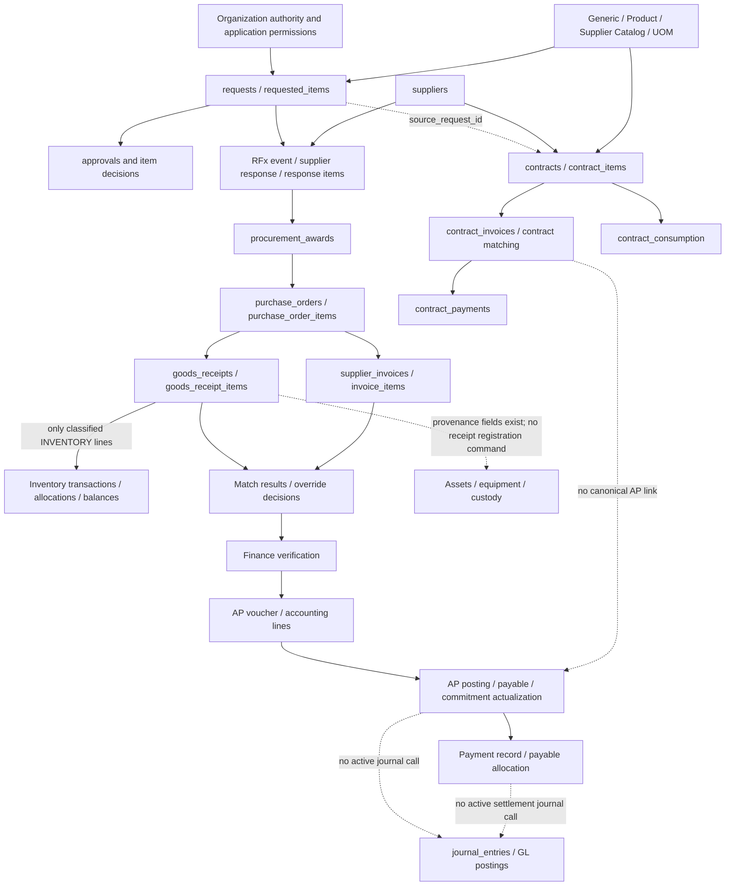

# Procure-to-pay architecture audit and remediation plan

## Decision and scope

The repository contains a connected procurement/AP subledger, but a user cannot
currently complete the proposed PR → approval → PO → receipt → invoice → AP →
payment → accounting cycle through the shipped screens. Several screens still
use earlier command contracts. Contract finance remains an independent active
invoice/payment system. Accounting journal generation is disconnected from the
current AP/payment writers.

Preserve the existing services and canonical relationships. Repair control gaps
and complete one usable transaction chain before adding more modules. Contract
finance needs immediate control containment, followed by a reviewed convergence
into the common AP/payment boundary. Replacing every item identity with a new
`item_master` table or rebuilding inventory is not justified by this audit.

Baseline: `origin/master`, commit
`673b2ec22581ad057a6dc2768d932935c3f6066a`, inspected on 2026-10-05.
This includes merged PR #6 (accounting validation) and PR #7 (disposable PostgreSQL
lifecycle verification). Findings describe that baseline, not earlier phase plans.

This is a repository/source audit. Routes, controllers, services, repositories,
schema definitions, frontend callers and related tests were traced across the
application. It is not a penetration test, a live-data reconciliation, or a full
functional certification of every adjacent hospital module. No database connection,
SQL execution, migration, application startup or production change was performed
for this audit. Only this report is added. Deployed types, RLS, constraints,
configuration and historical data remain unverified here.

Evidence labels used below:

- **Source-confirmed:** the current code has the stated behavior or missing check.
- **In-memory reproduced:** the actual pure calculation returned the stated result.
- **Deployment-dependent:** database constraints, permissions or data may change
  operational impact; their presence is not assumed.

## Actual architecture



The request-approved handoff in the diagram is a business requirement, not a
guarantee currently enforced by every RFx/award/PO command. Contracts are optional
sources/controls, not a mandatory intermediate step for every purchase. Internal
warehouse fulfillment is also a legitimate alternative to external procurement;
it must not be forced through a dummy supplier invoice or PO.

## Stage-by-stage ownership and links

All routes below are under `/api`. [Route mounting][mount] authenticates the
P2P, requests, suppliers and contracts routers. RFx uses optional authentication
at the mount and per-command checks for privileged actions.

| Stage / what exists | Live backend entry and owner | Previous-stage relationship | Next-stage relationship | Frontend status |
| --- | --- | --- | --- | --- |
| Purchase requisition | `POST /requests`; `createRequestController`; `requests`, `requested_items`, optional `requested_item_financials` [PR][pr] | Requester, institute/department/project; line Generic/Product identity and UOM snapshots | `approvals.request_id`; RFx/request/award links; some warehouse demand diverts to internal fulfillment | Request forms, `GenericItemSelector`, request lists/details exist |
| Request and item approvals | `PUT /requests/approval/:id` and `PATCH /approvals/:id/decision`; `approvals`, item approval fields/logs [legacy approval][legacyapproval], [decision router][approvalroutes] | `approvals.request_id`, assigned approver, level and route version/snapshot | Final approval updates `requests.status`, item decisions and assignments; downstream award does not independently require this evidence | `ApprovalsPanel` uses `useApprovalsData` and the **PUT requests** endpoint [caller][approvalui] |
| Procurement / sourcing | `/requests/:id/rfx`, `/rfx-portal`, response submission and `POST /rfx-portal/:id/award`; RFx event/response/normalized response items [award adapter][rfxaward] | `rfx_events.request_id`, `rfx_responses`, `rfx_response_items.requested_item_id` | Award controller creates line awards and a **draft PO in the same transaction** | `RfxPortalPage`, assigned-request/procurement workspaces and evaluation pages exist |
| Supplier selection | Supplier controllers/master, RFx response supplier; eligibility service called on award and PO issue [eligibility][supplierfacts] | Canonical `suppliers.id`; offered Catalog belongs to selected supplier and Product | `procurement_awards.supplier_id`, PO/invoice/payable supplier chain | Supplier/SRM/evaluation pages and controlled offering selection exist |
| Purchase order | Request-scoped creation and PO submit/approve/issue/cancel/close [routes][p2proutes], [service][poservice]; PO header/lines | Line `award_id`, `requested_item_id`, Generic/Product/Catalog IDs, source/base UOM and price provenance | Receipt/invoice line `purchase_order_item_id`; issue creates PO encumbrance | `ProcureToPayPurchaseOrdersPage` uses award selections; no manual free-text PO cutover needed |
| Goods receipt / GRN | `POST /procure-to-pay/requests/:id/receipts`; receipt service [GRN][grservice] | Required PO/header and unique PO-line IDs; request/PO containment checked | Accepted quantity supports matching; INVENTORY lines post movements/allocations; typed flow edges | Dedicated receipt page sends PO/line IDs and a key; lifecycle-page receipt form does not [working form][grui], [older form][lifecyclegrui] |
| Service / inspection acceptance | SERVICE line two-way matching exists; technical-inspection module and legacy request receipt gate exist [matcher][matcher] | PO service line; inspections use their own request/item evidence | No immutable service acceptance or general inspection/quarantine financial gate in active invoice matching | Inspection screens exist; no P2P service-entry/acceptance command identified |
| Procurement invoice | `POST /procure-to-pay/requests/:id/invoices`; `supplierInvoiceService`; `supplier_invoices`, `invoice_items` [invoice][invoiceservice] | Required PO, supplier identity, PO-line IDs and requested-item links | `invoice_match_results.supplier_invoice_id`, voucher invoice FK | Invoice register and lifecycle forms exist, but neither submits the complete current command [register][invoiceui], [lifecycle][lifecycleinvoiceui] |
| Matching / exception decision | Match/override/decline routes; matcher and latest-result/decision repository [matching service][invoiceservice], [queries][priorqueries] | PO line, accepted receipts, prior effective invoices, supplier/currency/price | Finance verification requires latest verified match or approved current override | Matching queue runs match; override API exists; no complete decision workspace is demonstrated |
| Finance verification / AP voucher | Request verify, voucher create and `/ap-vouchers/:id/verify`; `ap_vouchers`, `ap_voucher_lines` [verification][finverify], [voucher][apservice] | Verified supplier invoice and authoritative invoice total; balanced debit/credit validation | Verified voucher is authority for AP posting | Lifecycle buttons exist; invoice ID/key/debit line missing; no `verifyApVoucher` frontend API caller identified [buttons][financeui] |
| Posted accounts payable | Request `post-ledger` delegates to `apPostingService`; `finance_postings`, `ap_payables`, actual commitment evidence [posting][apposting] | Voucher and supplier invoice; locked PO encumbrance | `payment_allocations.ap_payable_id`; open balance and supplier ID | AP page is a register; its `Open` action is plain text; legacy direct `post-payable` API is disabled |
| Procurement payment | `POST /procure-to-pay/accounts-payable/:id/payments`; `payment_records`, `payment_allocations` [payment][payservice] | Posted voucher FK through payable; exact payable currency; sum of prior posted allocations | Payable/invoice projections and document edge; **no settlement journal call** | Payment page sends amount/method but no currency/key and loads only OPEN liabilities [payment UI][payui] |
| Accounting entry | `financeCoreService.createJournalEntry` and accrual helper; `journal_entries`, `journal_entry_lines`, `gl_postings`, `gl_posting_lines` [journal][journal] | Intended source type/ID and request, account/cost-center dimensions | Intended GL/reconciliation boundary; current AP and payment commands do not call it | Lifecycle lists journals/GL records and labels AP posting “Post Ledger”; no complete GL posting/close workflow |
| Contract invoice | `/contracts/:id/invoices`, match/status routes; `contract_invoices` [contract finance][contractfinance] | Contract FK, supplier ID, attachment/document ID; header net payable computed separately | `contract_payments.invoice_id`, optional consumption invoice link; **no AP/voucher bridge** | `ContractsPage` invoice/matching/financial-summary tabs exist |
| Contract payment / consumption | `/contracts/:id/payments`, status/amount edits and consumption entries; `contract_payments`, `contract_consumption` [payment writers][contractpayments] | Optional invoice ID; otherwise contract-only payment; independent source fields | Contract totals and risk/summary projections; **no canonical payment allocation or journal** | `ContractsPage` contains active independent payment creation [contract UI][contractui] |
| Completion / document history | Completion helper and facts query exist, but are not invoked by live lifecycle controller [completion][completion], [facts][completionfacts], [response][lifecycleresponse] | Aggregate quantities, active invoice counts, payable and commitment states | Intended independent procurement/receipt/finance completion; current request tracker still has Completed/Received | Lifecycle estimates progress from record existence; history also reads older projection tables |

### Authorization, audit, values, tests and competing implementations

“Tests exist” means a relevant test boundary exists, not that the complete user
workflow is tested. `audit_logs` is the transactional P2P domain writer.
`governance_audit_trail` logs writes **after** the HTTP response and catches
failures; it neither authorizes the request nor guarantees rollback [middleware][httpaudit].

| Stage | Authorization actually enforced | Audit evidence | Financial/quantity validation | Tests and competing/disconnected implementation |
| --- | --- | --- | --- | --- |
| PR | Authenticated actor; controller validates request/item modes, ownership/context and approval routing | `request_logs`; item-master audit for identity/exception actions | Estimates and budget warning; item identity/UOM validation; estimates are not final liability values | `createRequest`, item identity and request-edit tests; special request forms and `requested_item_financials` remain |
| Approvals | Active assigned approver checked by live handlers; route-specific item decisions; ranking gate enforces institute/department | Request/approval logs; some canonical audit events | Estimate/cost permission checks; approved quantity and item rejection decisions | Approval controller/engine/continuation tests; **two live decision handlers plus a separate service engine**; no universal downstream approved-demand gate |
| Procurement/RFx | `rfx.manage` or SCM/procurement role fallback; normalized line identity validation | RFx/request audit plus transactional award/PO audit and outbox | Normalized response quantity/price or constrained aggregate pricing; awards cap quantities | RFx pricing/identity and connected-P2P tests; manual requested-item procurement status/quantity paths remain |
| Supplier | Management controllers use `contracts.manage` [supplier controller][suppliercontroller]; award/issue check supplier eligibility | Master/module audit patterns differ; award records selection | Active status/compliance/catalog relationship checks; deferred category/blacklist checks explicitly reported | Supplier eligibility/reference/SRM tests; name-based find/create compatibility remains |
| PO | Manage permission/role on create, submit, approve, issue, cancel and close; no value-tier approval/SOD invariant in service | Mandatory same-transaction audit/outbox | Award remainder, supplier/currency/UOM provenance, derived totals, locked available budget | PO cutover/close and actual SQL service tests; no new independent PO writer found |
| GRN | Receipt permission/role; PO/request containment; inventory warehouse/institute/receive controls | Same transaction for receipt, stock, domain audit/outbox and flow links | Gross minus damaged/short; positive quantities; remaining accepted quantity cap | GRN/rollback/concurrency tests; legacy request “mark received” is separate and has a UOM adapter mismatch |
| Service / inspection | Existing inspection/request gates; no financial acceptance authorization boundary in matcher | Inspection audit does not become matching acceptance evidence | SERVICE bypasses receipt comparison; quarantine is not excluded by accepted receipt quantity query | Matching tests prove two-way behavior, not approved service delivery; integration remains incomplete |
| Procurement invoice | Invoice-manage permission/roles; request/PO and supplier links | Same-transaction invoice domain audit/outbox | Totals calculated from lines; supplier invoice identity lock/normalized uniqueness; storage/quantity precision gaps remain | Invoice/matching tests; former persistence writer fails closed with 410; contract invoice writer remains active separately |
| Match / override | Manage/override permissions with role fallbacks; reason and latest exception checked | Immutable result/decision rows plus audit/outbox | Supplier, currency, price, cumulative ordered/received quantity and value | Current matching/override tests; earlier `performInvoiceMatch` helper remains imported but is not the production command |
| AP voucher | Create/verify permissions and roles; verified invoice/effective match required; no actor-separation check | Mandatory voucher audit/outbox | Exact two-decimal, nonnegative, one-sided, balanced lines equal invoice total; no account-master validation | Accounting/AP validation tests; no functional frontend voucher-verification command |
| AP posting | Post permission/roles; verified voucher/effective match; PO encumbrance | Atomic finance posting, payable, actualization, projections, links and audit/outbox | Balanced authoritative totals and commitment cap | AP bridge/rollback/retry tests; “posting” is a subledger fact, not a journal entry |
| Procurement payment | Payment permission/roles; posted payable authority and currency; no separate payment-approval or bank-execution evidence gate | Payment allocation and audit/outbox are atomic | Locked payable; positive amount ≤ remaining allocation-derived balance; fractional-cent inputs are not explicitly rejected | Payment/partial/retry/concurrent service tests; status-only legacy endpoints return 410 |
| Accounting | Helper is not an exposed authorization boundary; caller owns transaction and policy | Source/request fields; no active P2P accounting event/reconciliation chain | Balanced exact cent lines and nonblank account code; no account eligibility/period/source-unique posting/reversal policy | Journal unit tests exist; helper is disconnected from active AP and payment commands |
| Contract invoice | Mutations generally `contracts.manage`; match handler lacks equivalent check; read scope not enforced in handlers | `contract_logs` and post-response governance audit; pool queries are separate commits | Number/toFixed matching flags; direct status input; no effective-match/AP gating shared with procurement | Contract approval/identity tests exist; no direct financial-writer tests located; duplicates AP invoice domain |
| Contract payment | `contracts.manage`; optional invoice containment at create; no AP or finance-approval authority | Separate write, projection and log queries | Create compares paid sum only when invoice supplied; edits/status transitions lack the same cap and currency control | No direct financial-writer/concurrency tests located; duplicates payment domain |
| Completion/history | P2P read handlers lack explicit view/resource scope checks | Mixed request/approval/finance/legacy lifecycle histories | Helper flags differ from tracker/UI flags; approved quantity aggregation uses requested quantity | Completion helper/integration tests exist; live endpoint/UI integration is missing |

## Status and relationship authority

| Domain | Current state path / authoritative evidence | Boundary to preserve or repair |
| --- | --- | --- |
| Request | Pending approvals → Approved/Rejected; legacy tracker later Completed/Received | These statuses do not prove receipt ledger, liability settlement or GL completion |
| PO | `PO_DRAFT` → `PO_PENDING_APPROVAL` → `PO_APPROVED` → `PO_ISSUED` → `PO_PARTIAL` / `PO_DELIVERED` → `PO_CLOSED`; cancellation has receipt restriction | Issue requires approval timestamp/actor and budget; approval provenance/SOD needs strengthening |
| Supplier invoice | `AP_INVOICE_SUBMITTED` → match verified/exception → `FINANCE_VERIFIED` → `AP_VOUCHER_CREATED` → `AP_POSTED` → `PARTIALLY_PAID` / `PAID` | Latest match/override is authority; re-matching financially advanced documents can regress projection/capacity |
| Voucher | `draft` → `verified` → `posted` | Voucher FK is payable posting authority; total remains owned by invoice |
| Payable/payment | `OPEN` → `PARTIALLY_PAID` → `PAID`; payment record is `paid` with allocation | Payment record means recorded settlement in this app; it does not demonstrate executed/reconciled bank movement |
| Contract finance | Invoice/payment enum lists include approved/paid/rejected/cancelled; handlers directly assign allowed statuses and creation accepts body status | These are a separate mutable financial lifecycle without the AP gates |
| Legacy lifecycle | `procurement_lifecycle_states`, state history and finance action history are read by UI | Current P2P writers use domain audit/outbox and entity states; imported transition helpers are not called by current P2P controller |

Canonical FK links are stronger than names/snapshots. `requested_items` is demand;
award → PO line → receipt/invoice line preserves that demand link. A supplier name
or immutable description/UOM snapshot is useful display/audit evidence when an ID
also exists. A snapshot becomes dangerous when it is used to select identity or
infer completion instead of the linked document facts.

Specific remaining copies/resolutions:

- RFx award updates `requests.purchase_order_id`, `purchase_order_number` and
  awarded-supplier/response fields even though a request can have multiple POs.
  Treat these as compatibility projections, not the sole canonical PO relationship
  [RFx projection][rfxprojection].
- Requested-item purchased/procurement/received fields and manually edited unit
  costs coexist with award/PO/GRN facts. They must not authorize AP or stock
  effects independently [status writer][itemstatus], [legacy receiving][legacyreceipt].
- `stock_items` is resolved by first Generic match at receiving, and by a name in
  legacy receiving. Lifecycle inventory display also joins by item name. Product,
  UOM and document provenance must determine identity instead [stock selector][stockselector],
  [lifecycle inventory][lifecycleinventory].
- Contract net payable, contract `amount_paid`, consumed value and financial
  summary each compute totals from separate mutable records/status subsets.
  `amount_paid` includes pending/approved payments whereas summary `total_paid`
  counts only paid payments [contract projection][contractpayments].
- Document flow stores a type plus a textual ID; list enrichment currently joins
  tables by ID alone. Table-local `id=1` is not a globally unique document identity
  [flow enrichment][flowquery].

## Prioritized findings

P0 = integrity, financial control or security. P1 = required for complete P2P.
P2 = architecture/maintainability. P3 = UX/optional improvement. P0 identifies an
uncontrolled boundary in source; it does not claim a production loss or exploit.

### P0-01 — Authentication is not complete resource authorization

Source-confirmed. P2P list/detail/lifecycle/document-flow handlers do not enforce
their frontend view permissions or actor institute/department scopes. Mutation
permissions are checked, but route request ID versus PO/invoice request ID checks
establish document containment, not whether the actor can access that request.
The database user context already has institute and `data_scopes`; these are not
used by the P2P query boundary. Contract financial reads and `matchContractInvoice`
also lack corresponding resource/management checks [mount], [auth], [p2pcontroller],
[contractfinance]. Actual exposure depends on deployed database-role/RLS behavior.

Remedy: reuse a common request/contract/object scope policy on reads and commands;
enforce view/action permissions server-side. Explicitly define central SCM versus
institute access. Verify denied users, guessed IDs and cross-institute IDs through
HTTP tests; do not rely on hidden pages or `governance_audit_trail` metadata.

### P0-02 — Approved demand and actor separation are not command invariants

Source-confirmed. RFx award loads `requests.status` but does not reject unapproved
requests; award service locks only the item and falls back from approved quantity
to requested quantity. It does not reject an item by request/item approval state.
The PO source-picker filters Approved requests, but the creation service does not
apply that picker filter as a write gate [rfxaward], [awardservice], [sourcepicker].
PO create/approve/issue uses the same manage capability; having that permission
can approve as well as create even without the SCM fallback role. The approve
service records the actor directly instead of an effective authority/threshold
decision. AP create/verify/post similarly lacks maker/checker separation
[poservice], [poapprove], [apservice], [apposting].

Remedy: require approved, nonrejected demand and current approved quantity inside
the transaction, then require effective approval authority and the agreed SOD
policy for PO, voucher and payment approval. Owner must decide thresholds and
permitted role combinations; exceptions need explicit governed evidence.

### P0-03 — Contract settlement bypasses canonical financial controls

Source-confirmed. Contract payment create defaults to `paid`, permits no invoice,
and does not require approved/effective matching, AP posting, matching currency
or finance authority. Invoice creation accepts a client status, and status
endpoints assign approved/paid directly. A failed-match invoice can remain in
the same payment universe [contractfinance], [contractpayments]. Advances may be
valid business documents, but this route does not distinguish an authorized
advance from arbitrary invoice-free settlement.

Remedy: first contain unsafe status/amount/currency/authority transitions without
destroying historical records. Define governed advance, retention and milestone
types. Then send all sources through common liability/settlement commands rather
than re-enabling disabled procurement status-only payment APIs.

### P0-04 — Contract overpayment and audit consistency are not atomic

Source-confirmed. Create reads the paid sum and inserts with separate `pool.query`
calls, without a transaction/row lock or idempotency key. Two 70 payments against
a 100 invoice can each see zero prior paid and pass. Editing a payment amount or
changing a pending payment to paid does not repeat the create-time overpayment
check. Payment/invoice updates, header projections and `recordContractLog` commit
separately; a later failure need not undo earlier financial mutation
[contractpayments], [contractfinance].

Remedy: atomic shared financial commands, locked liability/source, exact amount
and currency validation on every transition, immutable settled evidence, replay
keys and transactional domain audit/outbox. Reconciliation precedes writer cutover.

### P0-05 — Precision controls are inconsistent across quantity and payment

In-memory reproduced. `addDecimal` formats results to **two** decimals even when
used to sum four-decimal quantities. With ordered/accepted `0.0140`, previously
invoiced `0.0130` and new `0.0015` at price `1.00`, current matcher returns verified:
it compares rounded `0.01`, although real cumulative quantity is `0.0145`.
The award cap uses the same addition helper [decimal], [matcher], [awardservice].

`subtractDecimal('1.00','0.005')` returns `1.00`. Payment accepts such a raw amount;
two-decimal PostgreSQL payment/allocation storage can round the paid amount while
the calculated open balance follows a different rounding path [payservice],
[paymentcolumns]. The strict accounting validator applies to vouchers/journals,
not this payment command. Storage impact requires verification of deployed types.

Checked-in bootstrap invoice/receipt quantities also use two decimals, while
awards and the integration fixture use four. The fixture is not proof that deployed
storage preserves four-decimal receipt/invoice quantities [invoicecolumns],
[disposableschema].

Remedy: separate quantity precision from money precision, reject unrepresentable
inputs before writes, keep exact scaled arithmetic through caps and projections,
and verify deployed column types. Agree currency/rounding policy without inventing
an IQD conversion or accepting silent schema-dependent rounding.

### P0-06 — Financially advanced invoices can be re-matched and regress

Source-confirmed. `runInvoiceMatch` accepts any invoice lifecycle state. It writes
a new result and overwrites invoice status with the match state even after posting
or payment. Prior-capacity queries include invoices only when their latest match
and current status are eligible; re-matching a posted document into exception can
remove it from capacity calculations. Payment checks posted voucher authority,
not a policy governing this later exception [invoiceservice], [priorqueries],
[payservice].

Remedy: define and enforce post-verification/posting immutability. Corrections
must create governed credit/reversal/replacement evidence, preserving historical
quantity/value consumption and settled liabilities. Add tests for re-match and
override after voucher/posting/payment, not only before financial mutation.

### P0-07 — Receipt stock identity is ambiguous

Source-confirmed. `resolveReceiptStockItem` joins `stock_items` by Generic only,
orders by ID and takes the first row. With two approved products under one Generic,
the received Product can post to the other Product's Stock Item if UOM matches.
The subsequent inventory writer checks item existence and warehouse authorization,
not equality to the received Product [stockselector], [grservice], [inventoryposting].

Remedy: deterministic Generic/Product/UOM Stock Item resolution, explicit approved
generic-level fungibility policy where appropriate, and ambiguity rejection.
Persist the resolved stock identity with receipt-line/movement provenance. Do not
fallback to a display name or smallest ID.

### P0-08 — Repeated invoice lines bypass per-PO-line matching caps

Source-confirmed and in-memory reproduced. Invoice submission maps each input line
to a PO line, but does not reject repeated PO-line IDs. Matching compares each
line against prior **other invoices**, without accumulating earlier lines within
the current invoice. Two lines of quantity `6` at price `10`, both against the
same PO line ordered/accepted for `10`, return `MATCH_VERIFIED` with no variances,
although this invoice consumes quantity `12` and value `120` against line value
`100` [invoiceservice], [matcher].

The later whole-PO budget cap can reject some examples; it does not enforce a
line-level receipt/award cap when unused capacity exists on other PO lines.
Deployed uniqueness constraints may also limit impact and remain unverified.

Remedy: reject duplicate PO-line selections or aggregate all current invoice lines
by canonical PO line before matching quantity/value against prior consumption and
accepted delivery. Test repeated lines in one invoice, split invoices, and unused
budget on unrelated lines. Budget availability must not substitute for matching.

### P1-01 — Invoice, voucher and payment screens do not satisfy live commands

Source-confirmed. Invoice register submits `items: []`, no PO and no key. Lifecycle
invoice lines use requested-item IDs instead of PO-line IDs and omit PO/key.
Lifecycle receipt form also omits PO/PO-line IDs. Voucher creation omits invoice
ID/key and supplies only a credit line; posting omits its key and voucher verification
has no frontend command. Lifecycle payment buttons invoke 410 endpoints. Payment
register omits currency/key and excludes PARTIALLY_PAID payables, preventing the
remaining balance from appearing after the first payment [invoiceui],
[lifecycleinvoiceui], [lifecyclegrui], [financeui], [payui], [api], [disabled].

Remedy: a shared canonical PO-line invoice form; a real voucher create → verify →
post workspace; selected invoice/voucher/payable IDs; stable retry keys and correct
currency; OPEN plus PARTIALLY_PAID payment selection. Validate through actual form
actions and HTTP commands rather than mocked display snapshots.

### P1-02 — Inventory/asset classification is lost before receipt

Source-confirmed. Request identity stores `stocking_policy`. Award insert does not
store a downstream line type; governed PO snapshot does not select stocking policy.
PO creation defaults physical awards to NON_INVENTORY; only service exceptions
resolve SERVICE. Therefore ordinary physical awards do not reach the INVENTORY
branch that posts stock. The real SQL inventory tests explicitly seed the line
classification [identity], [awardinsert], [poservice], [testfixture].

Remedy: agree stock/nonstock/asset/medical-device/service behavior and carry the
governed classification through award/PO/receipt. Preserve existing nonstock and
exception rules; never classify all physical products as inventory automatically.

### P1-03 — Services and inspection do not provide financial acceptance

In-memory reproduced: a SERVICE invoice with no receipts matches TWO_WAY when
supplier/price/quantity/value agree. Receipt quantity for matching also counts
quarantined accepted units without an inspection financial-hold policy. Legacy
request receipt waits for technical inspection, but the P2P matcher does not use
that gate [matcher], [acceptedquery], [legacyreceipt].

Remedy: immutable approved service-entry/milestone and applicable inspection
acceptance evidence. Owner decides whether quarantine/rejection blocks matching,
posting, payment or all three, and defines partial acceptance/disputes. Reuse the
inspection module where its evidence fits; do not assume all POs require it.

### P1-04 — “Post Ledger” does not produce accounting entries

Source-confirmed. Active AP posting creates finance-posting/payable/commitment
facts and marks the voucher posted; payment creates allocations. Neither calls
the journal writer. `postProcureToPayAccrual` is imported in the controller but
not invoked by current commands. Its sample accounts are hard-coded expense/AP
codes, unsuitable as a universal stock/capitalization policy [apposting],
[payservice], [journal], [accrual].

Balanced amounts are implemented. Account eligibility, accounting periods,
source-unique posting, cash/bank settlement, reversals, FX and reconciliation are
not complete. AP line account code may also be null; unlike the general journal
helper, its validator does not require a code [accounting], [apline].

Remedy: decide internal GL ownership versus an external accounting integration.
Approve recognition/account mappings, entity/currency/period policy and source
uniqueness. Add an atomic journal or durable external-posting adapter plus
settlement and reversal evidence; reconcile AP and cash/GL. Do not call a
`finance_postings` row proof of complete accounting.

### P1-05 — PO closure blocks legitimate late AP posting

Source-confirmed. PO close releases the remaining active encumbrance without
requiring all delivered invoices to be posted. AP posting then requires that
active encumbrance. An invoice/voucher prepared before closing is correctly kept
financially unresolved by PR #7, but posting afterwards returns commitment exceeded.
Invoices cannot be newly submitted against `PO_CLOSED` either [poservice],
[apposting], [invoiceservice], [completionfacts].

Remedy: define operational close versus financial close and retain authoritative
capacity for accepted but unposted obligations, or block final commitment release
until resolved. Support late bills through a governed process. Avoid reopening
documents or reconstructing budget evidence with manual SQL.

### P1-06 — Completion authority is not exposed to the live workflow

Source-confirmed. `deriveCompletion` and `loadRequestP2PCompletionFacts` are used
by tests, not current production handlers. Lifecycle response returns raw/legacy
records without those flags. UI considers any PO, receipt, invoice and paid
payment enough to advance stages, so partial settlement can look complete.
Timeline also treats a voucher's existence as payment approval and uses substring
matching that can confuse match-result labels [completion], [lifecycleresponse],
[timeline].

The completion query calls summed **requested** quantity `approved_quantity`,
without using per-line approved quantity/rejection/diversion; it sums raw quantities
across lines/UOM rather than agreed per-line fulfillment facts [completionfacts].

Remedy: derive independent approval/procurement/acceptance/liability/settlement/
accounting flags in the live API, from current line-level source evidence. Keep
partial/cancelled remainder outcomes explicit. A legacy Completed/Received status
must not stand in for financial closure.

### P1-07 — Contract finance is a duplicate financial subsystem

Source-confirmed. Procurement uses `supplier_invoices` → voucher → payable →
allocation-backed payment. Contracts uses `contract_invoices` → mutable
`contract_payments`, plus consumption and separate totals. No shared invoice ID,
payable ID, normalized cross-source supplier invoice identity, payment allocation,
posting or reversal authority connects them [contractfinance], [contractpayments],
[apposting]. No production double-payment is claimed; there is no common writer
control preventing the same supplier bill being represented in both domains.

Convergence is more than changing a route: invoice submission currently requires
a PO, and AP posting requires that PO's budget encumbrance. Contract milestone
invoices/advances/retention cannot simply be passed into these functions without
a source-aware liability and budget/acceptance design [invoiceservice], [apposting].
`procurementPricingService` has contract/direct-price helper logic, but active PO
creation derives price from awards and the concrete repository lacks those helper
lookup methods [pricing], [poservice].

Remedy: common supplier invoice identity and AP/settlement authority with explicit
PO-backed and contract-backed source documents; contract remains terms/acceptance/
consumption owner. Define tax, retention, advance, penalty and currency treatment;
inventory legacy balances, preserve source IDs and reconcile before retiring writers.
No dummy PO, blind merge, deletion or dual payment writers during cutover.

### P1-08 — Legacy Stock receipt supplies an invalid inventory command

Source-confirmed. `/requests/:id/mark-received` for a Stock request calls
`addReceivedStockToWarehouse`. The helper selects by name and builds a line with
ID/stock ID/accepted quantity but no source UOM, base UOM or conversion factor.
The receipt inventory adapter requires those fields and throws for positive
accepted quantity [legacyreceipt], [legacyadapter], [inventoryadapter].

Remedy: classify this as internal/request fulfillment versus external PO receiving.
Use canonical Stock Item/UOM identity and appropriate ledger source evidence;
delegate effects to the inventory engine. Do not bypass the adapter requirement
or silently create a GRN unrelated to a supplier PO.

### P2-01 — Typed document flow is enriched by untyped IDs

Source-confirmed. List query joins PO/invoice/AP/payment tables on textual ID
without the recorded document type or request containment. Colliding IDs can
attach unrelated supplier/invoice labels and duplicate rows [flowquery]. RFx edges
use `AWARD` while award service uses `PROCUREMENT_AWARD`; request single-PO fields
also cannot represent the full multi-PO history [rfxprojection], [awardservice].

Remedy: type-and-ID-plus-scope resolution and a common document-type catalog.
Verify collisions and split awards/multiple POs. Retain display snapshots, but
never infer document relationships by a shared numeric ID.

### P2-02 — Approval, lifecycle and audit implementations still compete

Source-confirmed. Approval UI calls the legacy PUT handler; a PATCH handler and
service engine also exist. Service-engine guarantees do not automatically protect
the UI route. P2P controller retains unused imports/helpers for old matching,
lifecycle, financial history and accrual while current services use entity states
and audit/outbox. Requested-item manual status/cost paths remain [approvalui],
[approvalroutes], [legacyapproval], [engine], [p2pcontroller], [itemstatus].

Remedy: one decision/transition service behind compatibility adapters; owner-defined
meaning for request tracker statuses; unified domain events/projections and
query contracts. Remove dead helpers only after tracing every caller and preserved
historical read requirement. Keep disabled legacy financial writers fail-closed.

### P2-03 — Runtime DDL and test fixtures do not establish deployed schema

Source-confirmed. Request/controller/bootstrap helpers issue CREATE/ALTER during
runtime; contract `runEnsureDdl` swallows selected DDL errors. Existing schemas
are not rebuilt by CREATE IF NOT EXISTS, and later manual patches may differ.
Disposable P2P fixture omits RLS, unrelated modules, legacy rows and many deployed
constraints [contractddl], [invoicecolumns], [testfixture], [httpaudit].

Remedy: read-only development catalog/migration/constraint inventory and drift
checks first. Forward migrations only when necessary, explicitly reviewed and
manually applied by the owner. Move schema ownership out of ordinary HTTP traffic;
do not test these “ensure” handlers against a shared DB during an audit.

### P2-04 — Existing master governance needs continuity, not replacement

Generic Items, Approved Products, Supplier Catalog and controlled UOM already
form the item model. PR/award/PO and contract item validation use it; fixed asset
service already stores and validates PR/PO/GRN/supplier provenance
[identity], [contractidentity], [assetprovenance]. Supplier master/SRM/contacts/
principals and eligibility checks also exist [supplierfacts], [supplierreference].
Name-based compatibility lookup, deferred qualification checks and master edits
still need reconciliation. Bank-account authorization is not part of current
payment evidence. Do not add a competing master simply to fit a conceptual diagram.

Remedy: deterministic identity propagation, reviewed merges/aliases and historical
snapshot policy; clarify cross-institute versus global master ownership. Extend
missing legal/bank/qualification data only after the current fields and controls
are inventoried. Prove Product/UOM/stock identity through issue, assets and recalls.

### P3-01 — Operational UX and error handling need completion after controls

Payment/AP/matching register actions are incomplete; several pages have limited
error handling, status filters reflect earlier states, and financial buttons on
the lifecycle page are not individually permission-conditioned. Backend gates
must remain decisive. Add clear partial/held/exception balances, resumable retry
feedback, permission-aware actions and next-step navigation after P1 command
repair [payui], [financeui], [timeline]. No further dashboards/AI/RFID are needed
to establish this transaction backbone.

## Implementation sequence with acceptance gates

These are proposed subsequent tasks, not changes made by this audit. Each task
should be a dedicated reviewed branch/PR. Schema changes, if later needed, require
owner-reviewed forward migrations and manual deployment; no migration is created
or prescribed for immediate execution here.

| Order / exact task | Scope and dependencies | Required acceptance |
| --- | --- | --- |
| 1. Establish development schema and financial policy baseline | Read-only catalog/RLS/constraint/migration inventory; count and reconcile duplicate/unlinked invoices, paid records and liabilities across both sources. Owner decides institute/global scope, SOD/thresholds, service/quality hold gates, currency precision, late-close treatment and GL ownership. | Written control matrix and data exception inventory; no assumed migrations, automatic backfill or invented account mappings |
| 2. Enforce resource scopes and approved-demand authority | P0-01/02; protect P2P/contract reads, actions and guessed IDs; share effective authorization; require approved request/item quantities in RFx/award/PO commands; enforce maker/checker policy. | HTTP denial tests for view/action/cross-institute access, pending/rejected items, self-approval and changed approval evidence; allowed central access remains explicit |
| 3. Repair exact financial/quantity and immutable-state controls | P0-05/06/08; separate quantity/money arithmetic; aggregate or reject repeated invoice PO lines; storage precision contract; freeze posted matching or require governed reversal. | Fractional quantity/cent and repeated-line reproductions reject or compute exactly under approved policy; posted/paid re-match cannot release prior invoicing capacity; amount bounds/currency are enforced |
| 4. Contain legacy contract finance safely | P0-03/04 and cross-source duplicate risk; transaction/lock/key/permission/currency/effective-match gates on every financial transition; prevent edit/status paths bypassing limits; explicit authorized advances. | Concurrent, replay, audit-failure, invalid-state, overpayment, cross-currency and negative/nonfinite amount tests; historical data retained; no new separate accounting system |
| 5. Complete physical identity and acceptance handoff | P0-07/P1-02/03/08; governed classification, Product/UOM Stock Item resolution; distinguish internal warehouse fulfillment; service/inspection evidence where policy requires it. | Real stocked purchase updates the correct Product/warehouse once without test SQL classification; ambiguous identity fails; approved service/inspection and partial/quarantine policy demonstrated |
| 6. Repair invoice entry using canonical PO lines | P1-01; shared form for register/lifecycle with PO, selected lines, supplier ID, currency, exact values and stable retry key; server total remains authoritative. | Both entry points create the same linked invoice; duplicate retry returns prior invoice; partial billing/incorrect PO-line/currency scenarios handled |
| 7. Build the complete AP command workspace | P1-01/04; select verified invoice, create balanced mapped lines, verify voucher with effective authority, post with stable key; display independent voucher/posting/payable evidence. | Actual UI/HTTP create → verify → post succeeds for authorized distinct actors and fails at every unmet gate; one liability and budget actualization |
| 8. Complete allocation-backed payments | P1-01; OPEN/PARTIALLY_PAID selection, payable currency, exact amount, key/reference and owner-approved authorization/execution evidence. | Partial plus final settlement via UI; retries and competing writes produce one valid allocation per operation and never overpay; no status-only paid action |
| 9. Make closure and progress consume canonical facts | P1-05/06/P2-01; line/UOM-approved demand, accepted quantities and unresolved financial obligations; typed flow joins; operational versus financial/accounting close and late-bill policy. | Multi-PO/multi-invoice/partial/rejected/diverted/cancelled/service cases show correct separate flags; close cannot strand accepted obligations; colliding document IDs never mix |
| 10. Connect the agreed accounting boundary | P1-04, policy from task 1; source-unique account/period/entity-controlled journals or durable external ledger handoff; settlement, credit/reversal and reconciliation evidence. | Posted AP/payment creates exactly one appropriate accounting outcome; invalid period/account/currency rejected; retries/failures safe; AP/open liabilities/cash/ledger reconcile |
| 11. Prove the complete hospital purchase through UI/API | Uses tasks 2–10 and actual approved development schema; start with a goods purchase, then service/inspection and exception variants. | Request creation → actual approvals → RFx supplier selection → PO approval/issue → partial receipt → two invoices → match → AP → partial/final payment → accounting/close, without SQL intervention; unauthorized paths, concurrent retries, rollback and provenance verified |
| 12. Converge contract sources into common AP and settlement | P1-07; approved design for PO- and contract-backed invoices, milestone/advance/retention/tax/penalty handling; source ID mapping, normalized supplier-bill registry and reconciled legacy balances; contract consumption remains terms control. | One supplier obligation and one allocation/payment authority per bill; contract summary agrees with AP; no dual paid writer; forward migration/read adapters preserve evidence; owner approves manual cutover |
| 13. Extend proven provenance to assets/equipment/custody/recalls | Build on existing asset provenance and inventory ledger; receipt-driven reviewed registration/capitalization and serial/batch/location/issued-use continuity. | Received capital item inherits canonical links, cost/warranty and governed asset identity; issue/maintenance/spares/recall can locate stock and deployed items without manual recreation |
| 14. Consolidate architecture and reporting | P2-02/03/04 and P3; one approval/transition boundary, maintained master governance, schema drift checks, canonical KPI/event projections; integrate planning/workload afterwards. | Compatibility consumers preserved; report totals reconcile with ledger/source facts; optional analytics/AI does not become transaction authority |

The first complete-cycle gate is task 11. Contract convergence is the next major
integration after that gate, but containment of its current financial risks is
task 4 and should not wait. Accounting ownership and acceptance policy must be
decided early even though their implementation occurs after basic controls/UI.

## Verification performed and practical limits

This audit reran existing mocked/unit boundaries; it added no tests or behavior.

- Backend: 17 focused suites / **160 tests passed**. Command below.
- Frontend: 4 focused suites / **8 tests passed**. Command below.
- In-memory calls to current decimal/matching/completion helpers reproduced the
  fractional-quantity accepted match, receipt-free two-way service match,
  fractional-cent open-balance calculation and repeated-line overbilling match
  described above. No DB calls involved.
- Source searches followed actual call sites and checked competing financial
  writers, journal invocations, permission/scope use and frontend payloads.
- The earlier merged change ran 170 backend suites / 1,214 tests and 16 disposable
  PostgreSQL tests. Those are **prior results**, not reruns in this database-free
  audit. Its fixture/test limits are recorded in [the integration report](p2p-postgres-integration.md).

Backend command from `purchase-backend`:

```sh
npm test -- --runInBand --runTestsByPath \
  tests/phase4ConnectedP2P.test.js tests/rfxAwardPricing.test.js \
  tests/rfxIdentityCorrection.test.js tests/goodsReceiptService.test.js \
  tests/p2pBatch1Hardening.test.js tests/phase4ControllerCutover.test.js \
  tests/phase4PurchaseOrderClose.test.js tests/phase4PurchaseOrderCutover.test.js \
  __tests__/phase4cInvoiceMatching.test.js __tests__/phase4dAccountingBridge.test.js \
  __tests__/accountsPayableValidation.test.js __tests__/accountingEntryValidation.test.js \
  __tests__/connectedP2PRepositoryFinance.test.js tests/financeCoreService.test.js \
  tests/updateApprovalStatus.test.js tests/contractApprovalWorkflow.test.js \
  tests/phase2ParallelApprovalEngine.test.js
```

Frontend command from `purchase-frontend`:

```sh
CI=true npm test -- --watchAll=false --runInBand --runTestsByPath \
  src/api/procureToPay.test.js src/pages/ProcureToPayLifecyclePage.test.jsx \
  src/pages/ProcureToPayDashboardPage.test.jsx src/pages/ProcurementEvaluationsPage.test.jsx
```

The frontend lifecycle tests mock API responses and primarily test display.
Contract approval tests test reviewer routing, not invoice/payment safety. Neither
proves a user can perform the missing financial commands. No direct tests of the
contract invoice/payment writers were located by searching exported handler names
and matching helper calls across backend test directories.

No full backend/frontend certification, application build, live browser purchase,
Supabase MCP authentication, deployed migration/RLS check, bank execution or GL
reconciliation is claimed. The only repository change is this documentation;
**no database migration required and no deployment action required** for the audit.

## Source references

Links below are relative to this report and refer to the baseline stated above.
Line anchors are navigation aids; use the named functions if later commits shift
line numbers. The tables and findings cite the active paths rather than assuming
an old phase report accurately describes current deployment.

[mount]: ../../app.js#L386
[auth]: ../../middleware/authMiddleware.js#L84
[httpaudit]: ../../middleware/writeAuditTrail.js#L53
[pr]: ../../controllers/requests/createRequestController.js#L768
[legacyapproval]: ../../controllers/requests/updateRequestsController.js#L120
[approvalroutes]: ../../routes/approvals.js#L34
[approvalui]: ../../../purchase-frontend/src/hooks/useApprovalsData.js#L755
[engine]: ../../services/approvalEngine.js#L26
[rfxaward]: ../../controllers/rfxPortalController.js#L591
[rfxprojection]: ../../controllers/rfxPortalController.js#L712
[awardservice]: ../../services/procurementAwardService.js#L16
[awardinsert]: ../../repositories/connectedP2PRepository.js#L21
[supplierfacts]: ../../repositories/connectedP2PRepository.js#L68
[suppliercontroller]: ../../controllers/suppliersController.js#L118
[supplierreference]: ../../services/supplierReferenceService.js#L9
[p2proutes]: ../../routes/procureToPay.js#L40
[p2pcontroller]: ../../controllers/procureToPayController.js#L40
[poservice]: ../../services/purchaseOrderService.js#L14
[poapprove]: ../../controllers/procureToPayController.js#L255
[sourcepicker]: ../../controllers/procureToPayController.js#L430
[grservice]: ../../services/goodsReceiptService.js#L43
[grui]: ../../../purchase-frontend/src/pages/ProcureToPayGoodsReceiptsPage.jsx#L314
[lifecyclegrui]: ../../../purchase-frontend/src/pages/ProcureToPayLifecyclePage.jsx#L344
[invoiceservice]: ../../services/supplierInvoiceService.js#L29
[invoiceui]: ../../../purchase-frontend/src/pages/ProcureToPayInvoicesPage.jsx#L118
[lifecycleinvoiceui]: ../../../purchase-frontend/src/pages/ProcureToPayLifecyclePage.jsx#L367
[matcher]: ../../services/invoiceMatchingService.js#L22
[priorqueries]: ../../repositories/connectedP2PRepository.js#L157
[acceptedquery]: ../../repositories/connectedP2PRepository.js#L156
[finverify]: ../../services/financeVerificationService.js#L10
[apservice]: ../../services/accountsPayableService.js#L19
[apposting]: ../../services/apPostingService.js#L14
[payservice]: ../../services/paymentService.js#L11
[financeui]: ../../../purchase-frontend/src/pages/ProcureToPayLifecyclePage.jsx#L740
[payui]: ../../../purchase-frontend/src/pages/ProcureToPayPaymentsPage.jsx#L9
[api]: ../../../purchase-frontend/src/api/procureToPay.js#L32
[disabled]: ../../controllers/procureToPayController.js#L229
[journal]: ../../services/financeCoreService.js#L142
[accrual]: ../../services/financeCoreService.js#L213
[accounting]: ../../services/accountingEntryValidation.js#L29
[apline]: ../../repositories/connectedP2PRepository.js#L178
[contractfinance]: ../../controllers/contractsController.js#L3800
[contractpayments]: ../../controllers/contractsController.js#L3817
[contractui]: ../../../purchase-frontend/src/pages/ContractsPage.jsx#L808
[contractddl]: ../../controllers/contractsController.js#L1150
[contractidentity]: ../../services/contractItemIdentityService.js#L10
[identity]: ../../services/procurementItemIdentityService.js#L22
[assetprovenance]: ../../services/fixedAssetService.js#L65
[decimal]: ../../services/purchaseOrderTotalsService.js#L6
[stockselector]: ../../repositories/connectedP2PRepository.js#L144
[inventoryposting]: ../../services/inventoryPostingService.js#L37
[inventoryadapter]: ../../services/goodsReceiptInventoryAdapter.js#L6
[legacyadapter]: ../../controllers/requests/updateRequestsController.js#L108
[legacyreceipt]: ../../controllers/requests/updateRequestsController.js#L1927
[itemstatus]: ../../controllers/requestedItems/updateProcurementStatusController.js#L5
[completion]: ../../services/p2pCompletionService.js#L3
[completionfacts]: ../../repositories/connectedP2PRepository.js#L196
[lifecycleresponse]: ../../controllers/procureToPayController.js#L778
[lifecycleinventory]: ../../controllers/procureToPayController.js#L814
[timeline]: ../../../purchase-frontend/src/pages/ProcureToPayLifecyclePage.jsx#L56
[flowquery]: ../../controllers/procureToPayController.js#L736
[pricing]: ../../services/procurementPricingService.js#L2
[invoicecolumns]: ../../utils/ensureProcureToPayTables.js#L70
[paymentcolumns]: ../../utils/ensureProcureToPayTables.js#L131
[testfixture]: ../../integration/p2p.postgres.test.js#L48
[disposableschema]: ../../integration/fixtures/p2p.sql#L59
